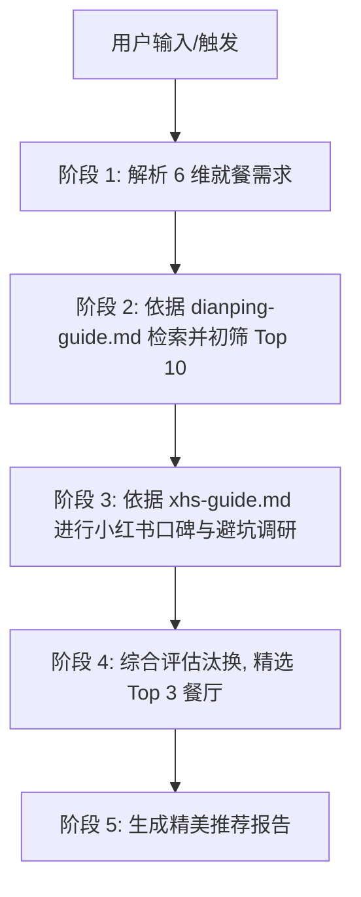

# 去哪儿吃 (Where to eat) - 附近餐厅推荐 AI 技能

`where-to-eat` 是一个为 AI 助手（如 Antigravity / Cursor / Claude Code）设计的自定义 Agent 技能（Custom Skill）。该技能旨在辅助用户筛选并推荐目的地附近的餐厅。

本项目的设计灵感和工作流设计参考了开源项目 **[hiyeshu/trip-map-builder](https://github.com/hiyeshu/trip-map-builder)**，通过融合大众点评的客观量化排名与小红书的真实质性用户反馈，帮助用户避开网红宣传陷阱，挑选出最合适、最真实的就餐场所。

---

## 🌟 核心功能特性

1. **多维度精细化筛选**：结合**就餐目的、口味要求、环境要求、人均预算、就餐时间、目的地/当前位置** 6 个维度进行全面考量。
2. **大众点评初筛 Top 10**：通过搜索引擎定向检索大众点评，基于商户评分、特色菜系及价格区间，快速建立前 10 名的优质备选库。
3. **小红书深度口碑与避坑调研**：针对备选餐厅，检索小红书真实用户笔记，深度挖掘**“真实口味是否相符”**、**“环境是否为照骗”**、**“实际排队与预订攻略”**以及**“集中差评与雷区”**。
4. **精选 Top 3 推荐报告**：综合量化和质性数据，生成包含详细推荐理由、主打招牌菜、排队避坑提示的精美 Markdown 报告。

---

## 📂 项目结构

```text
where-to-eat/
├── SKILL.md                  # 技能定义与触发配置（Agent 识别的入口文件）
├── README.md                 # 项目说明文档（本文件）
└── references/               # 调研指南与方法论
    ├── dianping-guide.md     # 大众点评检索策略与初筛过滤规则
    └── xhs-guide.md          # 小红书口碑挖掘与踩雷排查指南
```

*   **[SKILL.md](where-to-eat/SKILL.md)**：包含技能的 YAML 元数据和 Agent 执行的核心工作流。
*   **[references/dianping-guide.md](where-to-eat/references/dianping-guide.md)**：指导 Agent 如何构造高级搜索 Query 定向抓取点评商户，以及排除无关/倒闭店铺的规则。
*   **[references/xhs-guide.md](where-to-eat/references/xhs-guide.md)**：提供针对口味、环境、排队、服务质量的用户负面情绪（避坑/踩雷）分析方法。

---

## 🔄 核心工作流 (Execution Workflow)



### 详细步骤说明
1. **需求梳理**：Agent 提取就餐需求的六个核心要素，如因输入模糊导致要素缺失，可通过合理推断或简要提问补全。
2. **大范围初筛**：通过在搜索引擎中使用 `site:dianping.com` 定向查找，获取评分大于 4.0 且符合预算与菜系的 10 家候选餐厅。
3. **真实口碑透视**：在小红书检索 `<店铺名> <商圈> 避坑/踩雷/排队` 等词，过滤掉“营销软文”和“滤镜照骗”，提取用户真实推荐的必点菜与吐槽点。
4. **决策与淘汰**：剔除近期小红书上有严重食物卫生、恶劣服务或极度难吃反馈的店铺，保留 3 家最符合就餐目的的餐厅。
5. **产出报告**：输出排版美观的 Markdown 推荐信，供用户做出最终选择。

---

## 💬 触发词与使用方法

当您在配置了此技能的 Agent 会话中时，可以通过以下指令或类似意图触发该技能：

*   *"推荐一下新天地附近的本帮菜，人均200元左右，适合和朋友聚会，环境要安静一点，周末晚上去吃。"*
*   *"帮我筛选一下 [目的地] 的餐厅，就餐目的是 [目的]..."*
*   *"附近有什么好吃的本帮/江浙菜？按点评和小红书帮我挑 3 家适合约会的。"*

### 推荐报告输出示例
Agent 运行该技能后，会为您生成一份格式清晰的报告，包含：
*   **就餐需求卡片**
*   **初筛 Top 10 表格**（包含名字、评分、预算、特色菜）
*   **精选 Top 3 卡片**（带有**点评亮点**、**小红书实测反馈**、**避坑指引**和**推荐理由**）
*   **出行与订位执行建议**

---

## ⚙️ 技能配置说明

要让您的 AI助手加载此技能，请确保将本项目复制到您助手的技能加载目录中，例如：
*   **Workspace Customizations Root**：放置于当前项目的 `/skills/where-to-eat/` 路径下，或直接作为工作区根目录。
*   系统将自动扫描 `SKILL.md` 的 YAML Frontmatter 并注册触发词。
